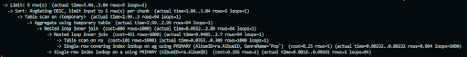
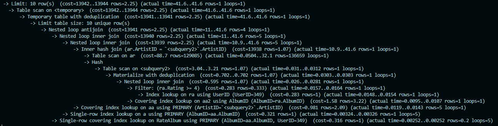
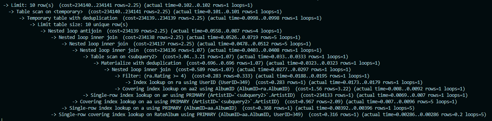
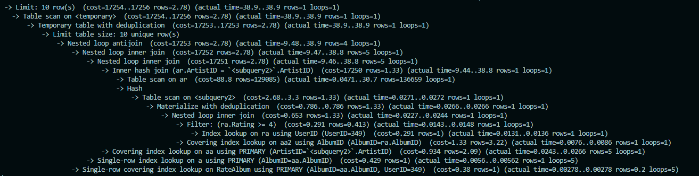
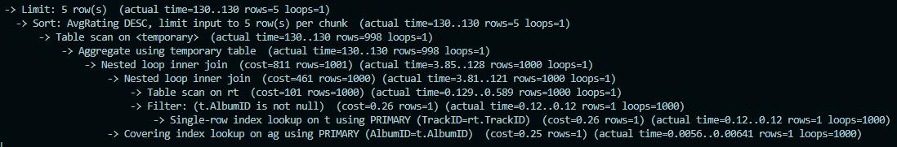
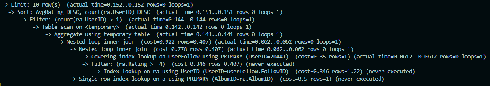

## Conceptual Design

We choose  to use ER Diagram for out conceptual design, you can find the diagram in [ER_diagram.md](./ER_diagram.md)

## Assumption

####  Entities:
- **User**: The assumption is that each individual will have a unique account with attributes that are personal and require privacy, such as email and password. A User entity is necessary because users will interact with the system in complex ways, such as creating playlists, following other users, and rating albums or tracks.
- **Album**: An Album is a collection of tracks, and it's more than just an attribute of a track because it has its own set of attributes like title and release date. Albums are linked to artists, but they are separate entities because an artist can have multiple albums, and albums can feature multiple artists.
- **Track**: A Track represents an individual song or piece of music. It's a separate entity from Album because while a track is part of an album, it also has independent attributes such as its title.
- **Artist**: An Artist could be an individual or a group that performs or creates music. This entity is separate from Track and Album because artists are not attributes of music but creators that can be linked to multiple works across various albums and tracks.
- **Genre**: Genre is used to categorize music and is an entity because it applies to both albums and tracks. It is not an attribute of either since a genre does not define a track or an album, but rather groups them into a wider music classification system.
- **Playlist**: A Playlist is a user-created list of tracks. It is an entity because it represents a collection of tracks. It also has a many-to-many relationship with tracks since a playlist can contain multiple tracks, and a track can be in multiple playlists.
#### Relationships:

- **Own (User-PlayList)**: it represent the relation between User and Playlist, and it's one-to-many because playlist can only owned by one user, but one user can have multiple playlists.
- **Have (PlayList-Track)**: This is a one-to-many relationship because an album contains multiple tracks, but each track is associated with only one album.
- **Made (Artist-Album)**: A many-to-many relationship is assumed here because a album may have multiple artists, and artists can contribute to multiple tracks.
- **Has (Album-Genre)**: Also many-to-many, since albums often fall into multiple genres, and a genre encompasses many albums.
- **RateTrack (User-Track)**: This is another many-to-many relationship facilitated by a Track_Rating junction table, allowing users to rate many tracks and tracks to receive ratings from many users.
- **RateAlbum (User-Album)**: This is similar to rateTrack relation, and has many-to-many relation.
- **Follow (User-User)**: A many-to-many relationship that indicate the relation that user can follow other user. 
- **Contains (Album-Track)**: similar to Made Relation, it represent what trake does each album have. it's one-to-many because each album can have many tracks, but a track can only be owned by a single album.

These assumptions stem from the understanding that users have complex interactions with music data, and the entities need to reflect the multifaceted nature of these interactions within the system. Each entity is modeled to capture a unique aspect of the music domain that cannot be reduced to mere attributes of another entity, ensuring the database is normalized and scalable.

##  Database Normalization

The schema adheres to 3NF across all tables. Each table ensures that:

- All attributes contain only atomic values.
- There is a full functional dependency of non-key attributes on the primary key.
- There are no transitive dependencies of non-key attributes on any other non-key attributes.

Given this analysis, there seems to be no need to apply BCNF, as all functional dependencies already have their left-hand side as a superkey, which complies with the BCNF requirements. 

## Logical Design
To translate the SQL schema into a logical design document, we will outline the structure and relationships of each table as defined by the SQL creation statements. This logical design will serve as a comprehensive guide to understanding the database's organization and its inter-table relationships.

### Entities:

**Artist**
   - **ArtistID** (INT, Primary Key, Auto Increment): A unique identifier for each artist.
   - **ArtistName** (VARCHAR(32)): The name of the artist.

**Album**
   - **AlbumID** (INT, Primary Key, Auto Increment): A unique identifier for each album.
   - **AlbumTitle** (VARCHAR(32)): The title of the album.
   - **ReleaseDate** (DATETIME): The release date of the album.

**Genre**
   - **GenreName** (VARCHAR(32), Primary Key): The name of the genre, serving as a unique identifier.

**Track**
   - **TrackID** (INT, Primary Key, Auto Increment): A unique identifier for each track.
   - **TrackName** (VARCHAR(128)): The name of the track.
   - **AlbumID** (INT, Foreign Key): Links the track to its album.

**User**
   - **UserID** (INT, Primary Key, Auto Increment): A unique identifier for each user.
   - **UserName** (VARCHAR(32)): The name of the user.
   - **Password** (VARCHAR(32)): The user's password.

**PlayList**
   - **PlayListID** (INT, Primary Key, Auto Increment): A unique identifier for each playlist.
   - **PlayListName** (VARCHAR(32)): The name of the playlist.
   - **UserID** (INT, Foreign Key): Links the playlist to its creator.
   - Represents the one-to-many relationship between users and playlists.

### Relationships:

**ArtistAlbum (Associative Table)**
   - **ArtistID** (INT, Foreign Key): Links to Artist.ArtistID.
   - **AlbumID** (INT, Foreign Key): Links to Album.AlbumID.
   - This table represents the many-to-many relationship between artists and albums.

**AlbumGenre (Associative Table)**
   - **AlbumID** (INT, Foreign Key): Links to Album.AlbumID.
   - **GenreName** (VARCHAR(32), Foreign Key): Links to Genre.GenreName.
   - This table establishes the many-to-many relationship between albums and genres.

**RateTrack**
   - **TrackID** (INT, Foreign Key): Links to Track.TrackID.
   - **UserID** (INT, Foreign Key): Links to User.UserID.
   - **Rating** (INT): The rating given by the user to the track.
   - This table captures the many-to-many relationship where users rate multiple tracks.

**RateAlbum**
   - **AlbumID** (INT, Foreign Key): Links to Album.AlbumID.
   - **UserID** (INT, Foreign Key): Links to User.UserID.
   - **Rating** (INT): The rating given by the user to the album.
   - Represents the many-to-many relationship between users and albums through ratings.

**UserFollow**
   - **UserID** (INT, Foreign Key): The follower's user ID.
   - **FollowID** (INT, Foreign Key): The followed user's ID.
   - This table models the many-to-many relationship where users can follow multiple users, and be followed by multiple users.

**ContainTracks (Associative Table)**
   - **PlayListID** (INT, Foreign Key): Links to PlayList.PlayListID.
   - **TrackID** (INT, Foreign Key): Links to Track.TrackID.
   - Models the many-to-many relationship between playlists and tracks, where playlists can contain multiple tracks, and tracks can belong to multiple playlists.

### Database Normalization and Integrity:

- The design adheres to the principles of database normalization up to the Third Normal Form (3NF) to ensure data integrity and reduce redundancy.
- Foreign key constraints facilitate referential integrity, ensuring relationships between tables are consistently maintained.
- The use of auto-increment primary keys ensures that each record within its respective table has a unique identifier.
- ON DELETE CASCADE constraints are applied to maintain integrity, automatically removing dependent records to prevent orphan records.

This logical design document serves as a detailed blueprint of the database structure, outlining how entities are related and interact within the system. It emphasizes the relational model's strength in representing complex relationships and enforcing data integrity.

## Relational Schema

Here, we cover the relational schema of our conceptual design:

**Artist**

Artist(ArtistID: INT [PK] ArtistName: VARCHAR(32))

**Album**

Album(AlbumID: INT [PK], AlbumTitle: VARCHAR(32), ReleaseDate: DATETIME)

**Track**

Track(TrackID: INT [PK], TrackName: VARCHAR(128), AlbumID: INT [FK to Album.AlbumID])

**User**

User(UserID: INT [PK], UserName: VARCHAR(32), Password: VARCHAR(32))

**PlayList**

PlayList(PlayListID: INT [PK], PlayListName: VARCHAR(32), UserID: INT [FK to User.UserID])

**Genre**

Genre(GenreName: VARCHAR(32) [PK])

**ArtistAlbum**

ArtistAlbum(ArtistID: INT [FK to Artist.ArtistID], AlbumID: INT [FK to Album.AlbumID])

**AlbumGenre**

AlbumGenre(AlbumID: INT [FK to Album.AlbumID], GenreName: VARCHAR(32) [FK to Genre.GenreName])

**RateTrack**

RateTrack(UserID: INT [FK to User.UserID], TrackID: INT [FK to Track.TrackID], Rating: INT)

**RateAlbum**

RateAlbum(UserID: INT [FK to User.UserID], AlbumID: INT [FK to Album.AlbumID], Rating: INT)

**UserFollow**

UserFollow(UserID: INT [FK to User.UserID], FollowID: INT [FK to User.UserID])

**ContainTracks**

ContainTracks(PlayListID: INT [FK to PlayList.PlayListID], TrackID: INT [FK to Track.TrackID])

## Indexing Analysis
### Advanced Query #1: get_top5_album_by_genre
#### No index added:

#### Index added on RateTrack(Rating):

#### Analysis:
Of the attributes in our get top 5 albums query, the RateTrack.Rating attribute was the only non-primary key, so we tried adding an index and using the EXPLAIN ANALYZE command. We discovered that the costs for both were basically the same. It’s hard to know exactly what the reason is for this, but it is possible that this is due to the fact that the ‘Rating’ column has only a couple of discrete values (1-5). This means that the column has low selectivity, which decreases the effectiveness of adding an index. Due to the fact that this change did not improve our cost, we decided to remove it and stick with our original index design.  

### Advanced Query #2: get_user_recommendations_by_artist
#### No index added (default):

#### Index added on Album.AlbumTitle

#### Index added on Artist.ArtistName

#### Index added on RateAlbum.Rating

#### Analysis:
We tried three different configurations (plus the default): index on Album.AlbumTitle, index on Artist.ArtistName, and index on RateAlbum.Rating. We selected these attributes because all three were not primary keys. Additionally, RateAlbum.Rating is part of a WHERE clause, which is optimal for indexing.  We found that the cost was essentially the same for the default configuration and Album.AlbumTitle indexes. The cost was worse for indexes on Artist.ArtistName and RateAlbum.Rating. Both Album.AlbumTitle and Artist.ArtistName are not included in any JOIN attributes or WHERE, GROUP BY, or HAVING clauses, so it makes sense that they do not have a positive impact on the cost. We only tried these attributes for thoroughness. Additionally, RateAlbum.Rating may see poor results because the rating is a discrete number between 1 and 5, which means it has low selectivity and will not make a great attribute to index. Because of these results, we decided to stick with the default configuration.

### Advanced Query #3: get_most_popular_tracks
#### No index added (default):

#### Index added on RateTrack.Rating

#### Analysis:
We tried one other index configuration, adding an index to RateTrack.Rating, plus the default configuration. We selected RateTrack.Rating because it is not a primary key. It is not a part of a JOIN attribute or WHERE, GROUP BY, or HAVING clauses, but we still tried anyway to see if we could see any marginal improvement as there were not any other non-primary keys that were part of this query. We did end up determining that there was a marginal improvement in cost for the configuration with an index added for RateTrack.Rating. We saw a marginal improvement in the cost of almost every aspect of this query (nested loop inner joins, filter, single-row index lookup, covering index lookup). Altogether, this meant that we saw a pretty substantial improvement in our overall cost estimation, especially since some lines that were looped many times had improved cost. Due to these results, we have decided to add an index to RateTrack.Rating.

### Advanced Query #4: get_recommend_album_by_follow
#### No index added (default):

#### Index added on RateAlbum.Rating

#### Analysis:
We tried one other index configuration with RateAlbum.Rating. This is because it is not a primary key, so we could potentially see some improvement. We saw a decrease in the cost on many parts of the query (nested loop inner join, filter, index lookup), and a slight improvement on the single-row index lookup. We previously theorized that this attribute might be seeing bad results when it is an index due to low selectivity, and this could be true here as well. Due to this, we decided to go with the original indexing, since overall we were getting a worse cost.

