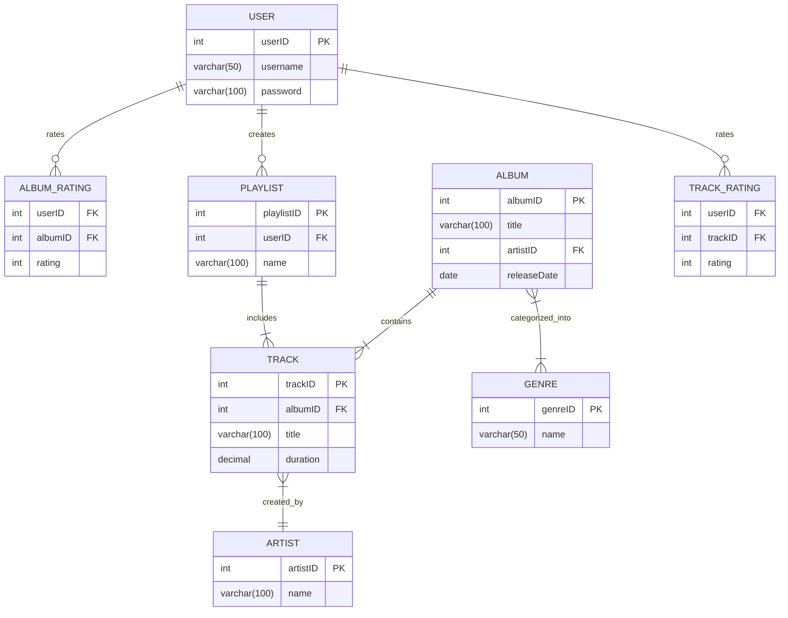

## ER Diagram

```mermaid
erDiagram
    USER ||--o{ ALBUM_RATING : rates
    USER ||--o{ PLAYLIST : creates
    ALBUM ||--|{ TRACK : contains
    TRACK }|--|| ARTIST : created_by
    ALBUM }|--|{ GENRE : categorized_into
    USER ||--o{ TRACK_RATING : rates
    PLAYLIST ||--|{ TRACK : includes
    ALBUM_RATING {
        int userID FK
        int albumID FK
        int rating
    }
    TRACK_RATING {
        int userID FK
        int trackID FK
        int rating
    }
    USER {
        int userID PK
        varchar(50) username
        varchar(100) password
    }
    ALBUM {
        int albumID PK
        varchar(100) title
        int artistID FK
        date releaseDate
    }
    TRACK {
        int trackID PK
        int albumID FK
        varchar(100) title
        decimal duration
    }
    ARTIST {
        int artistID PK
        varchar(100) name
    }
    GENRE {
        int genreID PK
        varchar(50) name
    }
    PLAYLIST {
        int playlistID PK
        int userID FK
        varchar(100) name
    }

```

