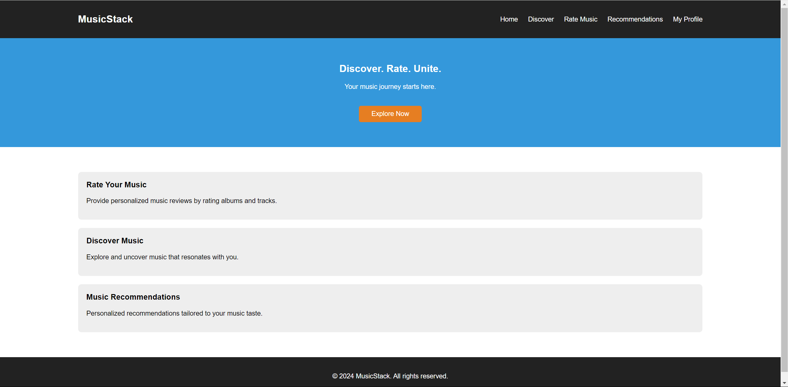
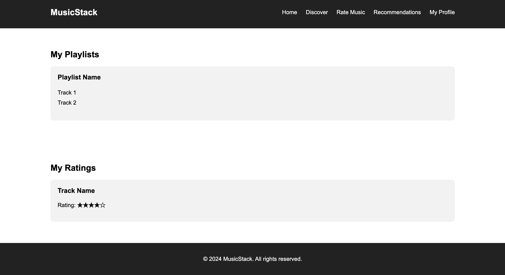

# Project Proposal

### Project Title

MusicStack

### Project Summary

Our database is designed to serve as a comprehensive music rating and discovery website. The core functionality of the platform allows users to rate their own music collections, including albums and tracks, providing a personalized music review experience. In addition to its rating features, the website offers robust search capabilities, allowing users to explore and discover albums and artists across various genres and eras. Besides, our website also incorporates a sophisticated recommendation system, which takes the user experience to the next level by personalizing music discovery based on individual preferences. Once users have rated a sufficient number of albums and tracks, and curated a list of their favorite music, the system employs algorithms to analyze their tastes and preferences.

### Description 

Our website tackles the challenge of finding music that aligns with personal tastes in today's saturated market. It offers a unique solution by allowing users to rate their music, share their preferences, and discover new tunes through a personalized recommendation system. This platform empowers users to explore and uncover music that resonates with them, fostering a community of shared musical interests and simplifying the discovery of new and unknown artists. By blending community-driven insights with tailored suggestions, our website ensures a more accessible and satisfying music discovery experience.

### Creative Component

Unlike mainstream music platforms such as Spotify and Apple Music, our website prioritizes rating, sharing, and recommending music. We are dedicated to enhancing the user experience by simplifying the process of sharing musical tastes with others. At the heart of our website is a sophisticated matching algorithm designed to recommend music tailored to individual preferences, making it easier and more elegant for users to discover songs they'll love. Our core mission is to foster a community where music enthusiasts can effortlessly exchange recommendations and explore a wide array of musical genres, guided by personalized insights.

### Usefulness

Our site will allow users to **rate music and view the ratings of others**, in addition to **receiving music recommendations** based on “shared taste” with other users. Some of our features would include a **searchable directory of songs**, courtesy of Spotify data, plus a user login system that would allow users to **generate reviews for these songs**. In addition, we will generate a list of recommended songs for each user that is created using “shared taste” with other users who rate songs in a similar fashion.

This is similar to the functionality of RateYourMusic, however we aim to use the rating system to generate songs that the user may like by utilizing a Markov chain. This may generate more helpful recommendations than other music recommendation sites because it takes into consideration shared taste with other users as opposed to just mood and genre.

### Realness

Our project sources data from Kaggle and open-source music databases, primarily in CSV format, totaling around 4GB. This data encompasses detailed album information and user ratings, crucial for our recommendation system. The album data provides insights into artists, genres, and tracks, while user ratings help tailor personalized music suggestions. This combination ensures a rich dataset for developing a user-driven recommendation engine, leveraging the depth of both music details and user preferences.

**Dataset we use:**

| Description    | Resources URL                                                | Entities                   |
| -------------- | :----------------------------------------------------------- | -------------------------- |
| Album Metadata | [**https://data.world/arcadeanalytics/best-500-albums-amazon-neptune**](https://data.world/arcadeanalytics/best-500-albums-amazon-neptune) | Album,Track,Artist,Genre   |
| Music Rating   | [**https://www.kaggle.com/datasets/ofurkancoban/discogs-releases-dataset/data**](https://www.kaggle.com/datasets/ofurkancoban/discogs-releases-dataset/data) | Track_rating, album_rating |

### Functionality 

**UI Mockup:**

Below shows the UI-mockup for the front page of the "Music Stack", which driven to provide a clean and modern design with a focus on ease of navigation. In addition, we provide a huge banner displaying new releases or featured playlists, with smooth animations as new content slides in.

We also create some simple static pages for mockup
+ [index page](assets/mockup/index.html)
+ [user page](assets/mockup/user.html)

**Features:**

- **Search Functionality**:
  - Search for songs, albums, artists, and playlists.
  - Advanced search options to filter by genre, release date, and popularity.

- **User Account Management**:
  - Create and update user profiles.
  - Save favorite tracks and artists.

- **Social Interaction**:
  - Follow friends to see their listening activities.
  - Like and comment on playlists.
  - Share music on social media platforms.

- **Recommendation Engine**:
  - Get personalized song and album recommendations based on listening history.

- **Top  Tracks**:
  - Explore the most popular tracks of specific genre.
  - Feature to update favorites based on trends.

**Work Distribution:**

Our project are major composed by three parts: database design, backend design, recommendation system, and frontend design, our work distribution for these three parts:

| Work                  | people                              |
| --------------------- | ----------------------------------- |
| Database Design       | yunfanh2, rzieg3, tianyih5, ericjm4 |
| Recommendation System | yunfanh2, rzieg3                    |
| Frontend              | ericjm4                             |
| Backend router Design    | tianyih5                            |
| Backend CRUD Implement    | yunfanh2                            |
